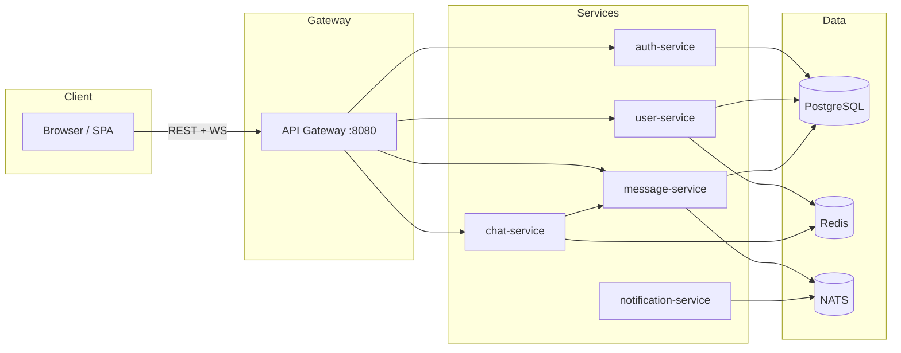

# Realtime Chat System — Golang Microservices

[](https://go.dev/)
[](./LICENSE)
[]()
[](./CONTRIBUTING.md)

**Production-style realtime chat** with JWT auth, WebSockets, friend discovery, direct & group chats, and an event-driven core. Built as multiple Go services behind an API gateway—not a monolith demo.

**Why this repo exists:** show how a chat product can be split into bounded services (auth, users, messaging, realtime transport) with clear data ownership, Dockerized deployment, and observability hooks.

> If this project helped you or you found it interesting, please give it a star — it really helps!

---

## Table of contents

- [Features](#features)
- [Live demo](#live-demo)
- [Screenshots](#screenshots)
- [Architecture](#architecture)
- [Design decisions](#design-decisions)
- [Scaling & operations](#scaling--operations)
- [Tech stack](#tech-stack)
- [Repository layout](#repository-layout)
- [How data flows](#how-data-flows)
- [API overview](#api-overview)
- [Configuration](#configuration)
- [Local setup (Docker + UI)](#local-setup-docker--ui)
- [Database migrations](#database-migrations)
- [Security & production hardening](#security--production-hardening)
- [Observability](#observability)
- [Testing](#testing)
- [Possible extensions](#possible-extensions-not-in-this-repo)
- [Out of scope](#out-of-scope)
- [Contributing](#contributing)
- [FAQ](#faq)
- [License](#license)
- [Author](#author)

---

## Features

| Area | What you get |
|------|----------------|
| **Auth** | Register / login, JWT access tokens, refresh token rotation (Postgres-backed) |
| **Realtime** | WebSocket connection per chat; typing indicators; messages fan-out via **Redis pub/sub** |
| **Persistence** | Messages and read receipts via **NATS** consumers in `message-service` |
| **Social** | Search users by **email / username**; **friends**; **direct chats** only between friends; **groups** only with friends (and add-member restricted to friends) |
| **Gateway** | Single entrypoint, **JWT validation**, **`X-User-Id` / `X-Request-Id`** injection, **rate limiting**, **CORS** for browser clients |
| **UI** | **Orbit Chat** static SPA + `go run ./cmd/serve-frontend` (settings: gateway base URL) |
| **Ops** | **Docker Compose** for all infra + services; **`/healthz`** and **Prometheus-style `/metrics`** on services |

---

## Live demo

**Hosted demo:** Not deployed yet.

**Local:** Follow [Local setup](#local-setup-docker--ui): UI at http://127.0.0.1:8888, API at http://localhost:8080.

---

## Screenshots

**Chat UI:** Not added yet.

**Architecture:** Not added yet.

---

## Architecture

High-level: the **browser** talks only to the **API gateway** (REST + WebSocket). The gateway forwards to internal services; **PostgreSQL** is the system of record; **Redis** handles presence and realtime fan-out; **NATS** decouples write-side events (persist messages, notifications).



### Service responsibilities

| Service | Port (default) | Role |
|---------|----------------|------|
| **api-gateway** | 8080 | Reverse proxy; auth middleware; rate limit; CORS; WebSocket upgrade to chat-service |
| **auth-service** | 8081 | Register, login, refresh; issues JWTs |
| **user-service** | 8082 | Profile (self-only), presence heartbeat (Redis), **user search**, **friends** APIs |
| **chat-service** | 8083 | **WebSocket** hub; membership check against message-service; Redis pub/sub; NATS publish for persist/receipts |
| **message-service** | 8084 | Chats, members, messages, receipts; **NATS consumers** for durable writes |
| **notification-service** | 8085 | Subscribes to notification-related NATS subjects (extensible) |

### Communication styles (REST vs realtime vs events)

- **REST (through gateway):** auth, users, chats, messages, friends, search.
- **WebSocket:** `GET /ws?chat_id=...&access_token=...` — realtime messages and typing; HTTP fallback `POST /messages` still works.
- **Redis:** channel `chat:<chat_id>` for live fan-out; presence keys for online status.
- **NATS:** e.g. `chat.message.persist`, `chat.receipt.persist`, `chat.message.created` — async, service decoupling.

---

## Design decisions

| Choice | Rationale |
|--------|-----------|
| **Microservices** | Separates **auth**, **identity/presence**, **durable messaging**, and **realtime transport** so each can scale and fail independently; matches how chat products evolve in production (different SLAs per path). |
| **Redis (pub/sub + presence)** | Low-latency fan-out to all sockets in a room without hitting Postgres on every keystroke; presence is ephemeral by nature—TTL-backed keys fit better than relational rows for “online now”. |
| **NATS (not direct HTTP for writes)** | Decouples **chat-service** from **message-service** availability: spikes or slow DB don’t block the WS loop; consumers retry at their pace; easy to add workers or swap persistence without changing the hot path. |
| **PostgreSQL** | Single source of truth for users, chats, messages, friendships, refresh tokens—ACID where it matters. |
| **API gateway** | One TLS termination and auth story for browsers; injects **`X-User-Id`** so downstream services stay simple and don’t re-parse JWTs everywhere. |

---

## Scaling & operations

- **Horizontal scale:** Run **multiple `chat-service` instances** behind a load balancer with **sticky sessions** (or shared Redis so any instance can publish/subscribe the same `chat:<id>` channels). **message-service** and **auth-service** scale statelessly behind the gateway once Postgres and NATS handle throughput.
- **Bottlenecks:** Postgres (writes + history reads), Redis (channel fan-out), NATS (subject throughput). Tune connection pools, add read replicas for history, and consider JetStream retention if you need replayable pipelines.
- **State:** User/chat/message state lives in **Postgres**; **Redis** is cache/ephemeral; **NATS** is transit—design consumers to be idempotent (e.g. message idempotency keys already supported on `POST /messages`).

---

## Tech stack

- **Go 1.22+**, **Gin**, **Gorilla WebSocket**
- **PostgreSQL 16**, **Redis 7**, **NATS 2** (JetStream-capable image)
- **Docker Compose** for local full stack
- **JWT** (shared secret; validated at gateway and chat-service)

---

## Repository layout

Monorepo with shared `pkg/` and per-service modules:

```
realtime-chat-system/
├── cmd/serve-frontend/     # tiny static file server for the SPA
├── docs/                   # swagger.yaml (gateway route)
├── frontend/               # Orbit Chat UI (HTML/CSS/JS)
├── migrations/             # Postgres SQL (001…003…)
├── pkg/                    # shared infra helpers (httpx, etc.)
└── services/
    ├── api-gateway/
    ├── auth-service/
    ├── user-service/
    ├── chat-service/
    ├── message-service/
    └── notification-service/
```

Each service follows a common internal layout: `cmd/`, `internal/handler|service|repository|model/`, `config/`, `Dockerfile`.

---

## How data flows

1. Client obtains JWT via `POST /auth/login` or `POST /auth/register` (through gateway).
2. **REST** calls include `Authorization: Bearer <token>`; gateway sets **`X-User-Id`** for downstream services.
3. Client opens **WebSocket** on the gateway URL with `chat_id` + token; **chat-service** validates JWT and checks **chat membership** via message-service before upgrade.
4. **Inbound WS events** (`message`, `typing`, `read_receipt`) publish to **Redis** for live fan-out; **message** / receipts are also sent to **NATS** for **message-service** to persist.
5. After persistence, **notification-service** can react to **`chat.message.created`** (extend for push/email).

---

## API overview

Base URL (local): **`http://localhost:8080`**

### Public

| Method | Path | Purpose |
|--------|------|---------|
| POST | `/auth/register` | Create user; returns tokens |
| POST | `/auth/login` | Login; returns tokens |
| POST | `/auth/refresh` | Rotate refresh token |

### Protected (`Authorization: Bearer`)

| Method | Path | Purpose |
|--------|------|---------|
| GET | `/users/:id` | Own profile only (`:id` must match JWT `sub`) |
| POST | `/users/:id/heartbeat` | Presence ping (Redis) |
| GET | `/users/search?q=` | Search by email/username (min 2 chars) |
| GET | `/users/friends` | List friends |
| POST | `/users/friends` | Body `{"user_id":"<uuid>"}` — add friend |
| POST | `/chats` | Create **direct** (friends only) or **group** (members must be friends) |
| POST | `/chats/direct` | Body `{"other_user_id":"<uuid>"}` — get or create DM (friends only) |
| GET | `/chats` | List my chats |
| POST | `/chats/:chat_id/members` | Add member (**group**; must be friend) |
| GET | `/chats/:chat_id/members` | Members (+ username/email) |
| POST | `/messages` | Send message (idempotency key supported) |
| GET | `/messages/:chat_id` | History (`limit`, `offset`) |
| GET | `/ws` | WebSocket (query: `chat_id`, `access_token`) |
| GET | `/docs/swagger.yaml` | OpenAPI-style description |

> **Note:** `POST /friends` on the gateway also proxies to user-service if you run a **new** gateway image; the SPA uses **`/users/friends`** so it works even with an older gateway build.

### Example: login + open DM (curl)

```bash
# Login
curl -s -X POST http://localhost:8080/auth/login \
  -H "Content-Type: application/json" \
  -d '{"email":"you@example.com","password":"yourpassword"}'

# Use access_token from response:
export TOKEN="<access_token>"

# Add friend then ensure direct chat (or use UI “Add & chat”)
curl -s -X POST http://localhost:8080/users/friends \
  -H "Authorization: Bearer $TOKEN" -H "Content-Type: application/json" \
  -d '{"user_id":"<friend-uuid>"}'

curl -s -X POST http://localhost:8080/chats/direct \
  -H "Authorization: Bearer $TOKEN" -H "Content-Type: application/json" \
  -d '{"other_user_id":"<friend-uuid>"}'
```

---

## Configuration

- **`.env.example`** — template for JWT TTL, Postgres, Redis, NATS, ports. Compose references it by default; copy to `.env` when you need overrides.
- **Important vars:** `JWT_SECRET` (change in any real deployment), `POSTGRES_*`, `REDIS_ADDR`, `NATS_URL`, per-service ports.

Never commit `.env` with real secrets; keep `.env.example` non-sensitive.

---

## Local setup (Docker + UI)

### Prerequisites

- [Docker Desktop](https://www.docker.com/products/docker-desktop/) (includes Compose)
- **Go 1.22+** (for `go run ./cmd/serve-frontend` and `go test`)

### 1) Start backend

```bash
cd realtime-chat-system
docker compose up --build
```

### 2) Run the web UI (second terminal)

```bash
go run ./cmd/serve-frontend
```

Open **`http://127.0.0.1:8888`**. In **Settings**, set API base to **`http://localhost:8080`** if needed.

### 3) Health checks

| Service | URL |
|---------|-----|
| API Gateway | http://localhost:8080/healthz |
| Auth | http://localhost:8081/healthz |
| User | http://localhost:8082/healthz |
| Chat | http://localhost:8083/healthz |
| Message | http://localhost:8084/healthz |
| Notification | http://localhost:8085/healthz |

### Stop

- `Ctrl+C` in compose terminal, then `docker compose down`  
- Wipe DB volume (destructive): `docker compose down -v`

---

## Database migrations

Files under `migrations/` are mounted into Postgres `docker-entrypoint-initdb.d` — they run **only on first init** of an empty data volume.

| File | Contents |
|------|----------|
| `001_init.sql` | users, chats, chat_members, messages, message_receipts |
| `002_refresh_tokens.sql` | refresh_tokens |
| `003_friendships.sql` | friendships (required for friends / friend-gated chats) |

**Existing volume?** Apply new SQL manually, e.g.:

```bash
docker compose exec -T postgres psql -U chat_user -d chat_db -f /docker-entrypoint-initdb.d/003_friendships.sql
```

---

## Security & production hardening

| Layer | What this repo does | Production follow-up |
|-------|---------------------|----------------------|
| **JWT** | HS256-style shared secret; validated at **gateway** (REST) and **chat-service** (WebSocket); `sub` = user id | Rotate **`JWT_SECRET`**, short access TTL, asymmetric keys (RS256) if multiple issuers |
| **Identity on wire** | Gateway sets **`X-User-Id`** and **`X-Request-Id`** on proxied requests | Ensure internal network is trusted; never expose downstream ports publicly without mTLS |
| **Rate limiting** | Token bucket on gateway (`api-gateway` middleware) | Tune per route; add IP/user-based limits at edge (CDN / WAF) |
| **CORS** | Enabled for browser SPA | Restrict **`AllowOrigins`** to your frontend origin only |
| **Data** | Passwords hashed in auth layer; friend-gated DMs/groups in message-service | Encrypt at rest (managed Postgres), audit logs, secret manager for env |
| **Transport** | Plain HTTP in Compose | Terminate **TLS** at ingress / reverse proxy; HSTS in production |

This repo is a **strong architecture demo**, not a turnkey public deployment—combine the above with **structured logging**, **distributed tracing**, and **alerting** on `/healthz` and error rates.

---

## Observability

| Signal | Where | Notes |
|--------|--------|------|
| **Liveness** | `GET /healthz` on each service | Use for orchestrator probes (K8s `livenessProbe` / Docker health) |
| **Metrics** | `GET /metrics` (Prometheus exposition) | Scrape per service; correlate with gateway latency and DB pool stats |
| **Request correlation** | `X-Request-Id` set at gateway | Propagate in logs across services when you add structured logging |
| **Realtime health** | WS connect success + Redis/NATS connectivity | Monitor chat-service restarts and NATS consumer lag |

---

## Testing

```bash
go test ./...
```

---

## Possible extensions (not in this repo)

Nothing below ships in this codebase today — these are **optional directions** if you harden or productize the stack:

- **Hosted demo** and **screenshots** under `docs/screenshots/` — not part of this repo today.
- **CI** — e.g. GitHub Actions for `go test`, linters, optional `docker compose` smoke (no workflow files here).
- **Published OpenAPI** — Swagger UI / GitHub Pages; today the repo has `docs/swagger.yaml` and the gateway exposes `GET /docs/swagger.yaml` when running locally.
- **NATS JetStream** or explicit **DLQ** handling for failed consumer messages (core path uses basic pub/sub consumers).
- **E2E** browser tests (e.g. Playwright) against a Compose test profile.
- **Kafka** bridge for orgs that mandate Kafka instead of NATS.

---

## Out of scope

- **Kafka** is not wired; **NATS** is the message bus here.
- **Kubernetes manifests / Helm** — bring your own cluster definitions.
- **Managed auth** (OAuth2/OIDC) — extension point only.

---

## Contributing

PRs and issues are welcome. See **[CONTRIBUTING.md](./CONTRIBUTING.md)** for guidelines (branching, commits, how to run tests). If that file is missing, open an issue or PR to add it—**PRs welcome** applies once the doc exists.

---

## FAQ

**Why not one Go binary?**  
A single deployable is simpler for tiny teams; this repo optimises for **clear boundaries** and **independent scaling**—the trade-off is more moving parts and operational surface.

**Can I swap Redis or NATS?**  
Yes, but you’d reimplement adapters: Redis drives room fan-out; NATS drives async persistence—replace with equivalents that fit your SRE standards.

**Friends table missing locally?**  
Postgres init scripts run only on first volume creation; apply `003_friendships.sql` manually (see [Database migrations](#database-migrations)).

---

## License

This project is licensed under the MIT License — see the [LICENSE](./LICENSE) file for details.

---

## Author

Aditya Paswan
